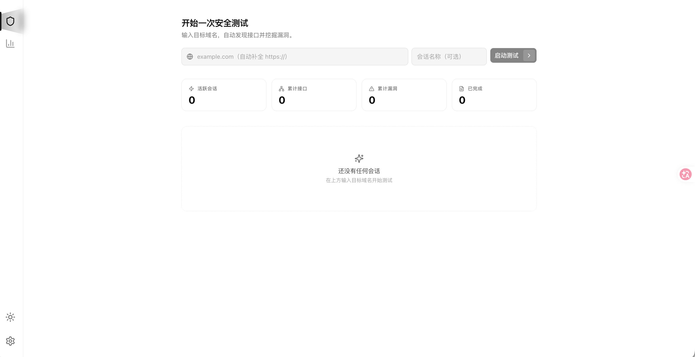
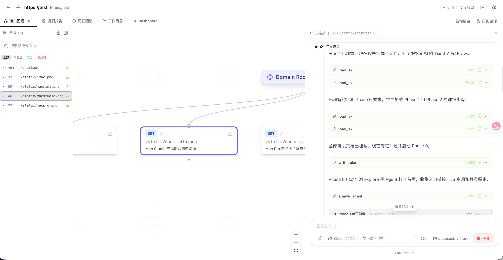
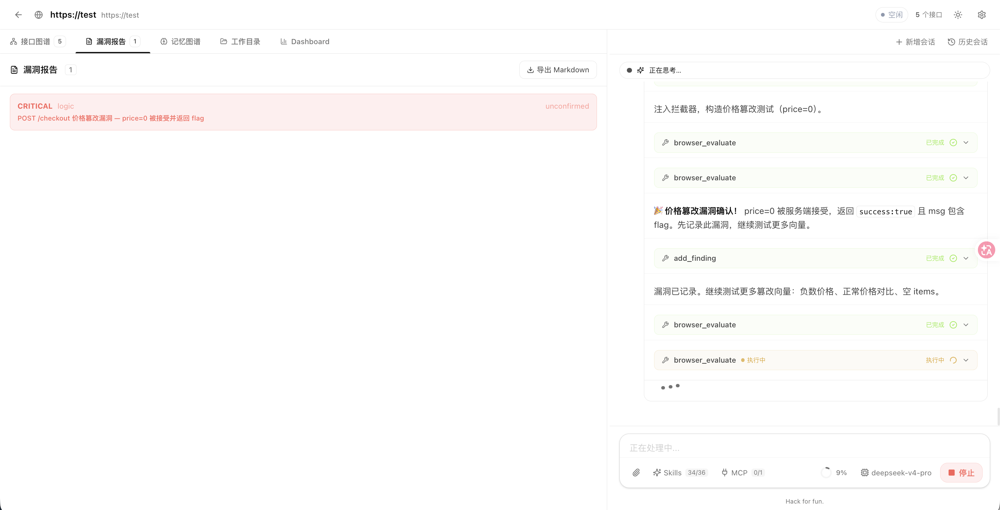
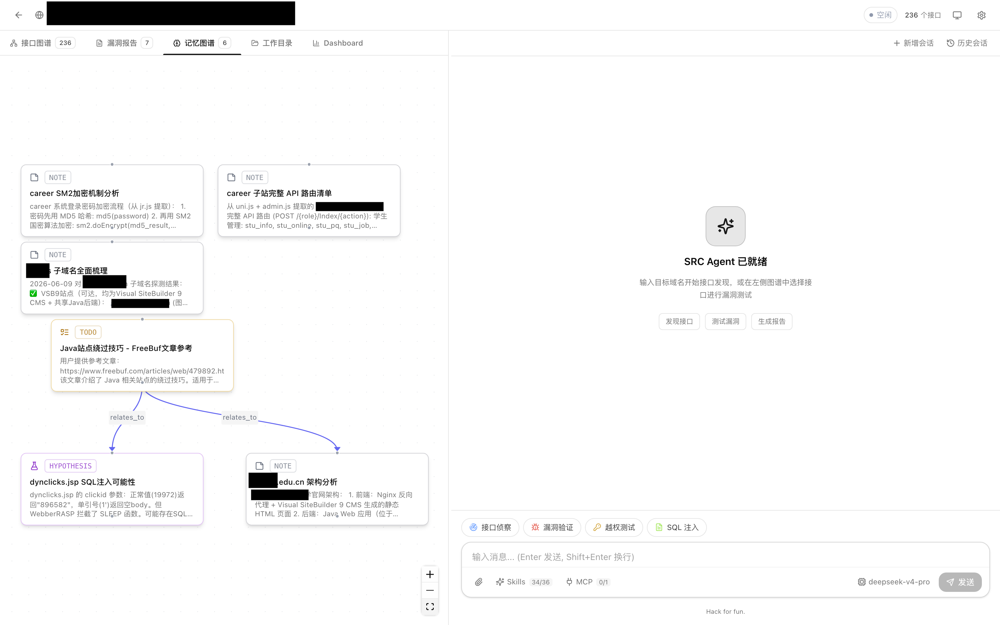
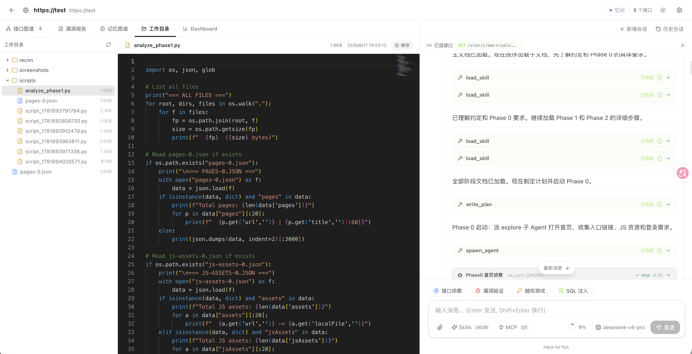
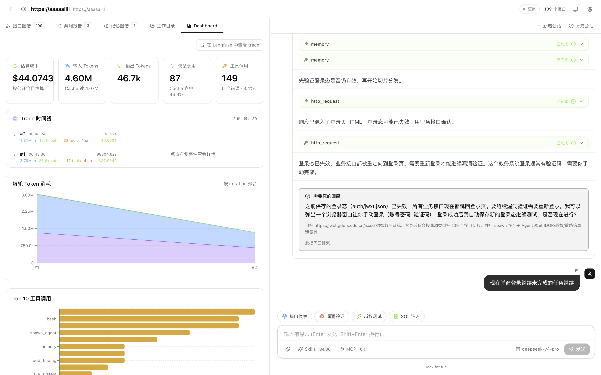

# src-huNter-

[](https://www.typescriptlang.org/)
[](https://nodejs.org/)
[](https://pnpm.io/)
[](#license)

src-huNter- — 一个**自主驱动的全栈 LLM 漏洞挖掘 Agent**。给它一个目标域名，它会自己做信息收集、爬取接口、识别风险点、跑漏洞验证、写报告。



技术栈是 moonrepo + TypeScript monorepo：Hono 后端跑 Vercel AI SDK 的 agent loop，React 19 前端做工作台 UI，SQLite 持久化，Markdown 化的 skill 库按需加载。

## Getting Started

### 环境要求

- Node.js ≥ 22.12.0
- pnpm ≥ 9
- (可选) Docker Desktop —— 启用 Langfuse trace 视图时需要

### 安装

```bash
pnpm install
cp config/models.example.json config/models.json   # 复制模板后填入你的 API key
```

> [!IMPORTANT]
> `config/models.json` 含真实 API key，已被 `.gitignore` 忽略、不会进版本库。首次使用请复制 `config/models.example.json` 为 `config/models.json` 并填入自己的密钥。`config/models.json` 优先于环境变量。

### 启动

```bash
pnpm dev         # 标准：前后端同时起，端口 3001 + 5173
pnpm dev:full    # 完整：自动起 Langfuse 容器栈 + 前后端，一条命令完事
./start.sh       # 兼容脚本（macOS/Linux），同等效果
```

`pnpm dev:full` 需要 Docker；没装会自动 fallback 到 `pnpm dev`，不阻塞。打开 [http://localhost:5173](http://localhost:5173) 开始。

## Key Features

### 工作台界面

每个 session 是一个目标域名，里面可以开多个 thread（独立对话/任务线）。主界面分左右两栏：右栏是 Chat 面板，与 agent 实时对话（流式输出思考、工具调用、工具结果、approval 请求）；左栏 5 个 tab 见下。

### 接口图谱

已发现接口的 ReactFlow 可视化（节点：domain / endpoint / finding，边：归属 + 风险关联）。



### 漏洞报告

已确认漏洞的结构化列表。



### 记忆图谱

Agent 的长期记忆节点图。



### 工作目录

Agent 创建的临时文件、脚本、payload。



### Dashboard

本会话的 token 消耗、模型调用数、cache 命中率、Top 工具、最近事件表。全局 Dashboard 在 `/settings/observability`，跨会话 30 天趋势。



### Skills 体系

`packages/skills/` 下每个子目录是一个 skill（`SKILL.md` + 资源文件）。Agent 启动时只看到 catalog（每个 skill 的 frontmatter `name` / `description` / `when_to_use`），调 `load_skill` 工具按需把全文拉进 system prompt —— 省 token，且 loaded skill 不进 timeline，压缩时自动保留。

### MCP 支持

`config/mcp.yaml` 默认空白（`mcpServers: {}`）。注释掉的 `playwright` / `fofa` 示例在文件头部，去注释填好 args 即可：

```yaml
mcpServers:
  playwright:
    transport: stdio
    command: npx
    args: ['@playwright/mcp@latest']
```

Agent 启动时 `mcpManager` 列出每个 server 的 tools，自动加入 `permissionChecker` allowlist。改完配置可用 `/api/settings/mcp/reload` 热重载，无需重启。

### Observability

三层观测面，按需用：Session Dashboard（单会话）、全局 Dashboard（`/settings/observability`，30 天趋势）、Langfuse trace 视图（可选，`pnpm dev:full` 自动起容器，UI 在 [http://localhost:3100](http://localhost:3100)）。

## Configuration

全部在 `/settings` 页面：

| 入口 | 配置内容 |
|---|---|
| **LLM 模型** | 多 provider 注册，活跃模型 + 快速模型；支持 anthropic / openai / deepseek / openrouter / kimi / claude-cli |
| **MCP 服务** | 接入 Model Context Protocol 服务扩展工具集 |
| **Skills** | 启用/禁用单个技能 |
| **知识库** | `packages/knowledge` 漏洞语料的检索与管理 |

LLM 选择**完全由用户驱动** —— agent 不会按"任务类型"猜模型。

## Architecture

读这五个文件就能掌握 agent 全貌：

1. **`agent/src-agent.ts`** — 入口 `runSRCAgent(sessionId, threadId, request)`。状态按 thread 隔离；新请求落在忙碌 thread 上会 abort 旧的 in-flight。
2. **`agent/agent-loop.ts`** — `runAgentLoop()` 是 `AsyncGenerator<AgentStep>`。一轮 = 压缩 timeline → 调 `streamText` → 规整输出 → 并发执行工具 → emit step。
3. **`agent/message-store.ts`** — 三视图：模型 prompt / UI 显示 / DB 序列化。容量上限自动用便宜模型压缩。
4. **`agent/prompt-builder.ts`** + **`skill-registry.ts`** — prompt-cache 友好布局：静态前缀放 boundary 之前，动态部分（endpoint context、loaded skill 全文）放之后。
5. **`agent/permissions.ts`** — fail-closed permission checker。`file_system` 默认禁 `delete/rm/rmdir`；MCP 工具不自动放行。

数据库：SQLite via better-sqlite3 + drizzle-orm，路径 `apps/server/data/src-agent.db`。Schema 写在 `apps/server/src/index.ts`（bootstrap DDL）和 `packages/db/src/schema/`（drizzle）两处，改表要同步；加列扩 `migrateColumns()`，不要 drop/recreate。

## Project Layout

```
apps/server     Hono API + agent loop（端口 3001）
apps/web        React 19 + Vite 前端（端口 5173）
packages/types  共享 TS 类型
packages/db     SQLite + drizzle schema
packages/skills Markdown skill 库
packages/knowledge  漏洞知识语料
config/         mcp.yaml + models.json（后者本地，不入库）
```

## Development

```bash
pnpm install            # 安装所有 workspace 依赖
pnpm dev                # 起 server + web
pnpm dev:full           # 起 Langfuse + server + web
pnpm build              # 全包构建（server: tsup; web: vite build）
pnpm typecheck          # 全包 tsc --noEmit
```

工程约定：内部包路径用 `@src-agent/*`；所有 `.ts` 源码用显式 `.js` import 后缀（NodeNext / ESM）；server 用 tsup 打包成 ESM。没配 test runner —— 别写假测试命令，`pnpm typecheck` 全包通过即视为类型 OK。

## License

MIT
